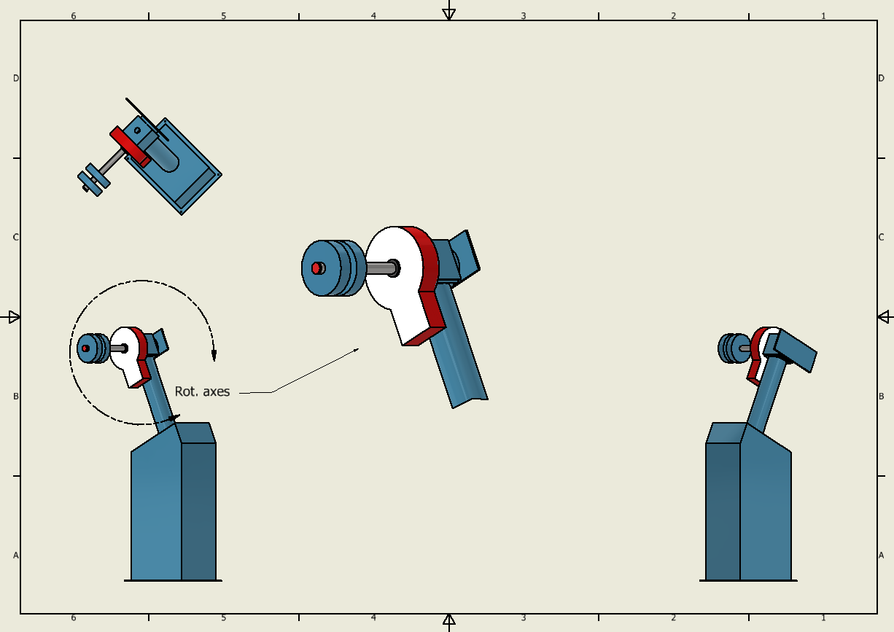
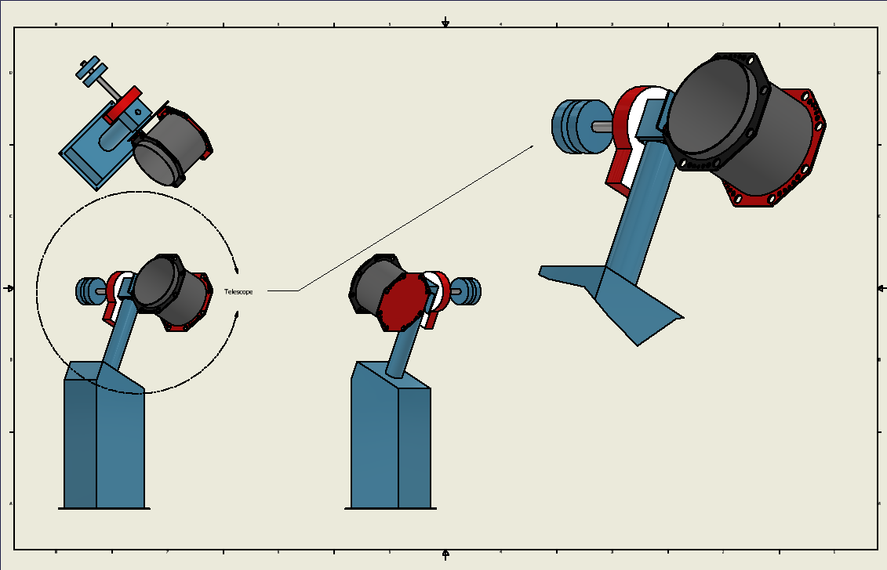
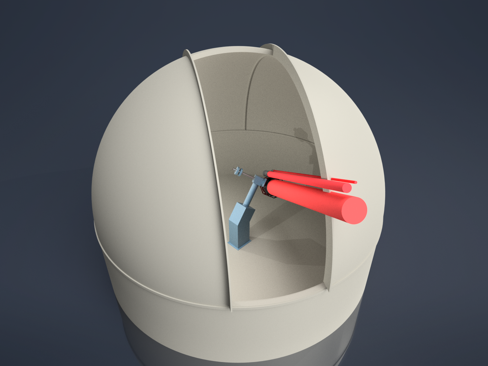
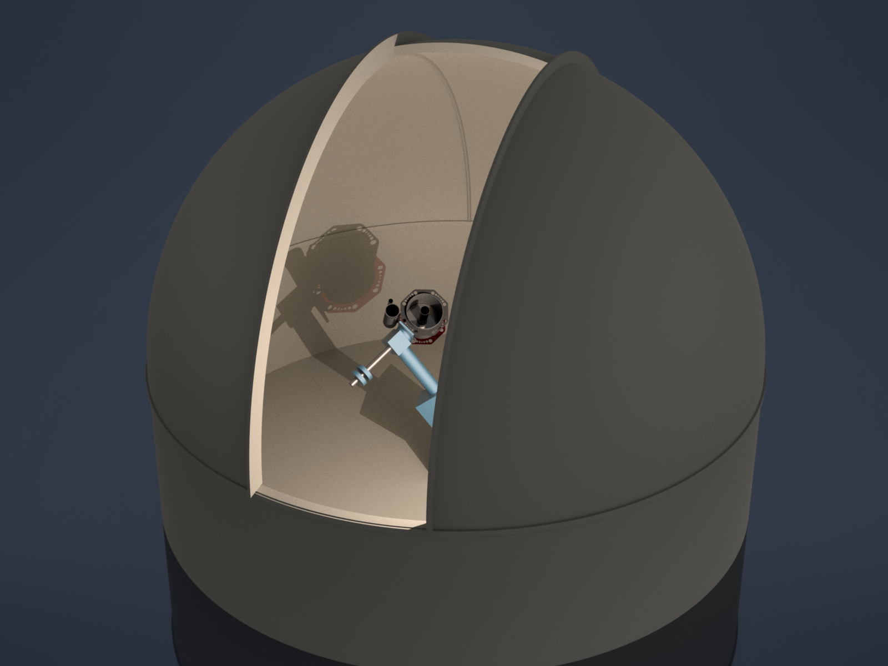

# BSc Project: Dome Control

Repository where I'll store files, e.g. python code or (autodesk) inventor projects, related to my BSc thesis project for Astronomy.

## Autodesk Inventor Gallery

### Telescope

See below a recreation of the equatorial mount of the Gratema telescope, and another one with the tube of the main mirror attached.

### Telescope-Dome System

See below three renders of the model of the Blaauw observatory telescope-dome system. More can be found in the `inventor/exports` directory. (1) Telescope pointing with an HA of -3.22 hours and a declination of 7.83 degrees, (2) same orientation, but with _beams_ extruded from the apertures of the telescope, guider, and finder, (3) HA of -3.33 hours and a declination of 27 degrees, with the dome at an azimuth of 103 degrees.

