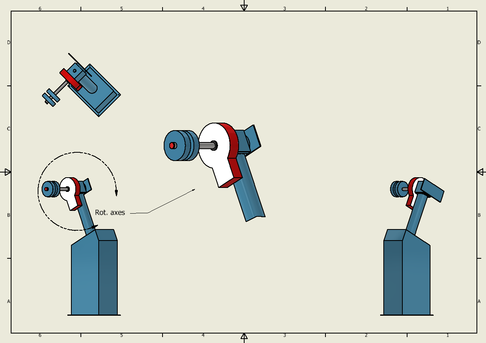

# BSc Project: Dome Control

Repository where I'll store files, e.g. python code or (autodesk) inventor projects, related to my BSc thesis project for Astronomy.

## Autodesk Inventor Gallery

### Telescope Mount

See below a recreation of the equatorial mount of the Gratema telescope.

