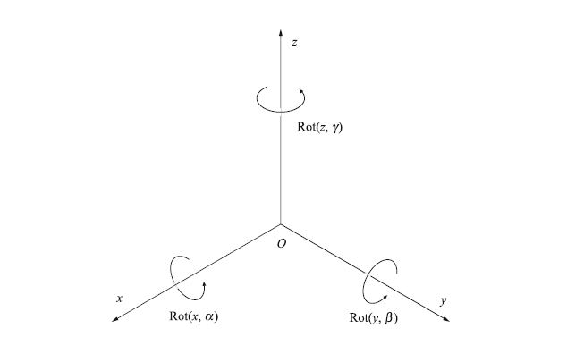

# Transformation Matrices

Notes based on chapters 2-4 of the book [*Robotics*](https://link.springer.com/book/10.1007%2F978-3-319-72911-4).

## Coordinate System

We consider a (right-handed) coordinate system as the one shown in the figure below. Along the $x,y,z$-axes, resp. with rotation angles $\alpha$, $\beta$, $\gamma$.

## Translations

We can define a transformation matrix $\text{H}$ as,

$$
\text{H}=
\text{Trans}(x,y,z)=
\begin{bmatrix}
1 & 0 & 0 & x\\
0 & 1 & 0 & y\\
0 & 0 & 1 & z\\
0 & 0 & 0 & 1
\end{bmatrix}
$$

This matrix can be used, for instance, to translate an initial position,

$$
\mathbf{r}_0=
\begin{bmatrix}
x_0\\
y_0\\
z_0\\
1
\end{bmatrix}$$

by a distance $(x,y,z)$ along the appropriate axes. Note that the fourth row is a dummy index.

## Rotations

We can rotate the coordinate system (show in the figure above) by use of the following rotations matrices $\text{R}_x(\alpha), \text{R}_y(\beta),\text{R}_z(\gamma)$ (see the book for a derivation):

$$
\text{R}_x=\text{Rot}(x,\alpha)=
\begin{bmatrix}
1 & 0 & 0 & 0\\
0 & \cos\alpha & -\sin\alpha & 0\\
0 & \sin\alpha & \cos\alpha & 0\\
0 & 0 & 0 & 1
\end{bmatrix},
$$

$$
\text{R}_y=\text{Rot}(y,\beta)=
\begin{bmatrix}
\cos\beta & 0 & \sin\beta & 0\\
0 & 1 & 0 & 0\\
-\sin\beta & 0 & \cos\beta & 0\\
0 & 0 & 0 & 1
\end{bmatrix},
$$

$$
\text{R}_z=\text{Rot}(z,\gamma)=
\begin{bmatrix}
\cos\gamma & -\sin\gamma & 0 & 0\\
\sin\gamma & \cos\gamma & 0 & 0\\
0 & 0 & 1 & 0\\
0 & 0 & 0 & 1
\end{bmatrix},
$$

Note that, e.g., $\text{R}_x$ assumes that the angle between the $x$-axes in both the original and rotated frame is zero. Sometimes the sines/cosines are written as $c_\alpha,s_\alpha$ instead of $\cos\alpha,\sin\alpha$, i.e. in the case of $\text{R}_x$.

## Transformations

The translations/rotations are applied *left to right*, e.g.,

$$\text{H}=\text{Trans}(x,y,z)\text{Rot}(x,\alpha)\cdots$$

implies that we first translate the given coordinates by $(x,y,z)$ and then rotate along the $x$-axis, etc.

We can denote the pose of a certain reference frame to another, i.e. consider the reference frames $(x_0,y_0,z_0)$ and $(x_1,y_1,z_1)$, then $^0\text{H}_1$ would denote the pose of a vector in frame 1 as a vector in reference frame 0. Consider the application of $n$ consecutive transformations, then $^0\text{H}_n$ can be written as,

$${}^0\text{H}_n={}^0\text{H}_1\, {}^1\text{H}_2\, {}^2\text{H}_3\,\cdots\, {}^{n+1}\text{H}_n$$
