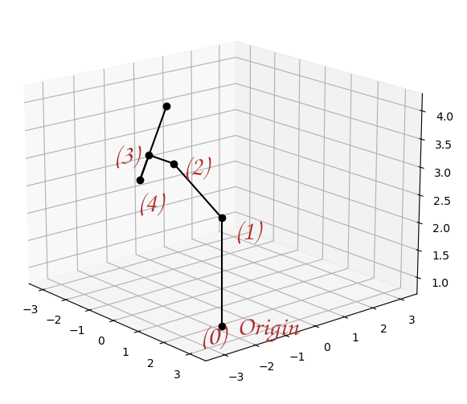

# Telescope Pointing

Here I describe a method to:

1. compute the position of the telescope aperture in the dome.
2. compute the direction the telescope in pointing to in the telescope-dome frame.

To achieve these goals, we use the transformation matrices (defined in one of the other notes), to compute the position of the telescope aperture (on the declination axis of the telescope) in the frame of the dome. Consider the figure below; a rough sketch of the telescope and mount. Note: (0) is the origin of the dome, (1) is the height of the RA axis above the floor of the dome, (2) is the intersection of the RA and Dec axis, (3) is the intersection of the telescope tube center and the declination axis, (4) could be some position along the optical axis of the telescope.
 

|Line segment | Length (mm) |
| ---         | ---         |
| $0-1$       |             |
| $1-2$       |             |
| $2-3$       |             |
| $3-4$       | _arbitrary_ |

## Telescope Position in the Dome

Assume that the center of the dome's floor defines the origin of the first coordinate system we consider. With origin vector,

$$
\mathbf{r}_0=
\begin{bmatrix}
0\\
0\\
0\\
1
\end{bmatrix}$$

Note that the $y$-axis points along the same direction as the front of the mount and the $z$-axis pointing north from the dome floor. 

Initially, we perform a transformation ${}^0\text{H}_1$,

$$
{}^0\text{H}_1 =
\begin{bmatrix}
1 & 0 & 0 & 0\\
0 & 1 & 0 & 0\\
0 & 0 & 1 & \ell_1\\
0 & 0 & 0 & 1
\end{bmatrix}
$$

Then, from the second reference frame created by that translation, we define,

$$
{}^1\text{H}_2=\text{Rot}(x,\phi)\text{Rot}(z,h)\text{Trans}(0,0,\ell_2)=
\begin{bmatrix}
1 & 0 & 0 & 0\\
0 & \cos\phi & -\sin\phi & 0\\
0 & \sin\phi & \cos\phi & 0\\
0 & 0 & 0 & 1
\end{bmatrix}
\begin{bmatrix}
\cos h & -\sin h & 0 & 0\\
\sin h & \cos h & 0 & 0\\
0 & 0 & 1 & 0\\
0 & 0 & 0 & 1
\end{bmatrix}
\begin{bmatrix}
1 & 0 & 0 & 0\\
0 & 1 & 0 & 0\\
0 & 0 & 1 & \ell_2\\
0 & 0 & 0 & 1
\end{bmatrix}
$$

where $\phi$ is the latitute and $h$  the hour angle. *(Note, the [lat. at the Blaauw observatory](https://www.findlatitudeandlongitude.com/) is $\phi=53.24\,\text{deg}$.)*  

We find,

$$
{}^1\text{H}_2=
\begin{bmatrix}
\cos h & -\sin h & 0 & 0\\
\cos\phi\sin h & \cos\phi\cos h & -\sin\phi & -\ell_2\sin\phi\\
\sin\phi\sin h & \sin\phi\cos h & \cos\phi & \ell_2\cos\phi\\
0 & 0 & 0 & 1
\end{bmatrix}
$$

Now, to compute the pose matrix to the center of the telescope aperture, along the declination axis, we have,

$$
{}^2\text{H}_3=\text{Rot}(x,\delta)\text{Trans}(-\ell_3,0,0)=
\begin{bmatrix}
1 & 0 & 0 & 0\\
0 & \cos\delta & -\sin\delta & 0\\
0 & \sin\delta & \cos\delta & 0\\
0 & 0 & 0 & 1
\end{bmatrix}
\begin{bmatrix}
1 & 0 & 0 & \ell_3\\
0 & 1 & 0 & 0\\
0 & 0 & 1 & 0\\
0 & 0 & 0 & 1
\end{bmatrix}
$$

Therefore, we find,

$$
{}^2\text{H}_3=
\begin{bmatrix}
1 & 0 & 0 & \ell_3\\
0 & \cos\delta & -\sin\delta & 0\\
0 & \sin\delta & \cos\delta & 0\\
0 & 0 & 0 & 1
\end{bmatrix}
$$

If we require the position anywhere else, a distance $y$ from the origin of the 3rd frame, along the optical axis/centre of the telescope, we can do another translation:

$$
{}^3\text{H}_4=\text{Trans}(0,y,0)=
\begin{bmatrix}
1 & 0 & 0 & 0\\
0 & 1 & 0 & y\\
0 & 0 & 1 & 0\\
0 & 0 & 0 & 1
\end{bmatrix}
$$

Note that the $y$-axis in the *final* reference frame points along the direction of the telescope's aperture.

## Aperture Direction Vector

We can find the direction the telescope (aperture) is pointing in by taking the difference between two points on the telescope's optical axis in the origin frame.

Consider, for instance, the points:

$$\mathbf{r}_t(0)={}^0\text{H}_3\, \mathbf{r}_0$$

and

$$\mathbf{r}_{t}(y)={}^0\text{H}_4(y)\, \mathbf{r}_0$$

noting that the second point is variable and depends on $y$. Then we can define the direction (a unit vector) as,

$$\hat{\mathbf{d}}=\frac{\mathbf{d}}{||\mathbf{d}||}$$

where $\mathbf{d}=\mathbf{r}_t(y)-\mathbf{r}_t(0)$. I.e., one could use,

$$\hat{\mathbf{d}}=\big\{\,{}^0\text{H}_4(y)-{}^0\text{H}_4(0)\,\big\}\, \mathbf{r}_0$$

## Sampling the Aperture

To sample the disk-shaped aperture, we can add another transform:

$$
{}^4\text{H}_5=\text{Trans}(x,0,z)=
\begin{bmatrix}
1 & 0 & 0 & x\\
0 & 1 & 0 & 0\\
0 & 0 & 1 & z\\
0 & 0 & 0 & 1
\end{bmatrix}
$$